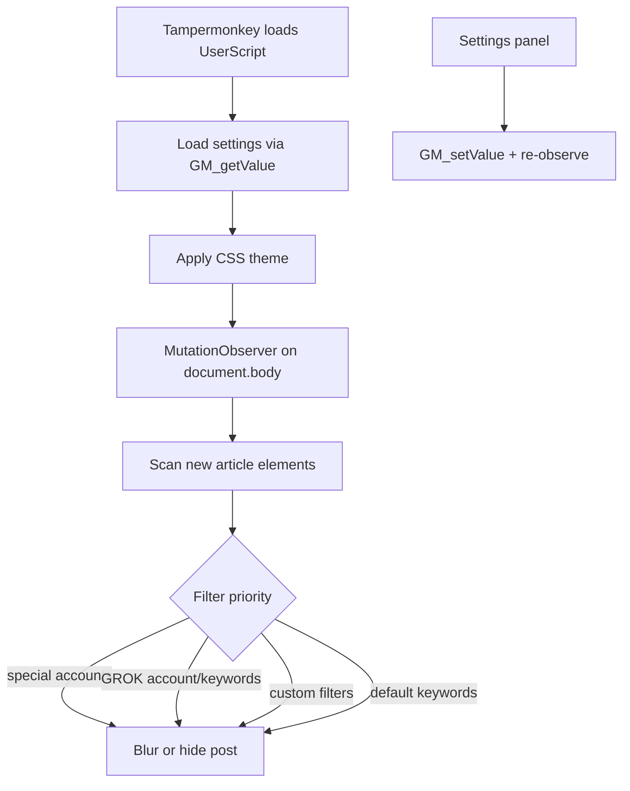

# X-Twitter-Filter

**A Tampermonkey userscript that blurs or hides distracting posts on X (Twitter).**

[](LICENSE)
[](X(Twitter)Filter.js)
[](https://github.com/dogukannparlak/X-Twitter-Filter)

---

## About

I built this because my X feed kept filling up with content I didn't want to engage with — sports drama, political noise, bot-generated replies, and the usual "agenda-shifting" posts that crowd out everything else. Scrolling past them wasn't enough; I wanted them out of sight without unfollowing half the platform.

**X-Twitter-Filter** (originally *Kitleleri Uyutma Aracı Engelleyici*) watches the page in real time and filters posts that match keywords, specific accounts, or GROK-related content. You can blur them with a click-to-reveal overlay, or hide them entirely.

This is a **personal open-source project** — one JavaScript file, no build step, no dependencies. Install it, tweak the filters, and make it yours.

> **Note:** The primary install path is **Tampermonkey / Violentmonkey**. A `manifest.json` is included for reference, but loading it as an unpacked browser extension is **experimental and unsupported** — the script relies on Tampermonkey's `GM_*` APIs.

---

## Features

- **Blur or hide** — choose how filtered posts are handled
- **Keyword filtering** — default sports/Turkish football terms plus your own custom keywords
- **Account filtering** — block posts from specific usernames
- **GROK detection** — filter `@grok` posts and GROK-related keywords
- **Custom filter categories** — named groups with their own keywords and overlay messages
- **Filter strength** — light (4px), medium (8px), or strong (12px) blur
- **Themes** — Dracula, Nord, or custom colors
- **Settings panel** — tabbed UI for all options (General, Accounts, Keywords, Custom Filters, Shortcuts)
- **Import / export** — back up and restore your filter config as JSON
- **Tampermonkey menu** — quick access to settings, reload, and developer links

---

## How It Works



**Filter priority** (first match wins):

1. Special accounts (e.g. configured politicians/public figures)
2. GROK account (`@grok`)
3. GROK keywords
4. Custom filter categories
5. Default + extra keywords

---

## Installation

### Option A — One-click install (recommended)

1. Install a userscript manager:
   - [Tampermonkey](https://www.tampermonkey.net/) (Chrome, Firefox, Edge, Safari)
   - [Violentmonkey](https://violentmonkey.github.io/) (Firefox, Chrome, Edge)
2. Open the raw script URL and confirm installation:
   ```
   https://raw.githubusercontent.com/dogukannparlak/X-Twitter-Filter/main/X(Twitter)Filter.js
   ```
3. Visit [x.com](https://x.com) or [twitter.com](https://twitter.com) — the script runs automatically.

### Option B — Manual install

1. Clone this repo (see [Development](#development) below).
2. Open your userscript manager → **Create new script**.
3. Paste the contents of `X(Twitter)Filter.js` and save.

---

## Usage

### Opening settings

- Click the Tampermonkey icon → **⚙️ Ayarları Aç** (Open Settings)
- Press **`Alt + Shift + K`** (when keyboard shortcuts are enabled)

### Settings tabs

| Tab | What you can configure |
|-----|------------------------|
| **Genel** (General) | Enable/disable filtering, blur vs hide, theme, filter strength |
| **Hesaplar** (Accounts) | Comma-separated usernames to filter |
| **Anahtar Kelimeler** (Keywords) | Default and extra keyword lists |
| **Özel Filtreler** (Custom) | Named filter groups with custom messages |
| **Kısayollar** (Shortcuts) | Keyboard shortcut reference and quick links |

### Blur mode

Filtered posts show a colored overlay with the filter reason. **Click the post** to reveal the content underneath.

### Import / export

Use the buttons in the Custom Filters tab to export your settings as JSON or import a previously saved config.

---

## Keyboard Shortcuts

| Shortcut | Action |
|----------|--------|
| `Alt + Shift + K` | Toggle settings panel |

Shortcuts can be disabled in the General settings tab.

---

## Configuration

Settings are persisted via Tampermonkey storage (`GM_setValue` / `GM_getValue`) under the key `uaSettings`.

**Default keyword examples:** `futbol`, `maç`, `derbi`, `galatasaray`, `fenerbahçe`, `#GSvFB`, and more.

**Default filtered account:** `realDonaldTrump` (editable in settings).

You can reset to defaults by clearing the script's stored data in Tampermonkey, or by importing a fresh config.

---

## Development

No build tools required — this is a single vanilla JavaScript file.

```sh
git clone https://github.com/dogukannparlak/X-Twitter-Filter.git
cd X-Twitter-Filter
```

1. Edit `X(Twitter)Filter.js`.
2. Save in Tampermonkey (or reload the page if using `@updateURL`).
3. Test on [x.com](https://x.com).

To pull updates:

```sh
git pull origin main
```

---

## Contributing

Contributions are welcome! See [CONTRIBUTING.md](CONTRIBUTING.md) for guidelines on reporting bugs, suggesting features, and submitting pull requests.

---

## Author

**[Doğukan Parlak](https://x.com/dogukanparIak)**

Originally developed in the **Opera GX Türkiye** community. Co-credited: `/dursunator`.

---

## License

This project is licensed under the [MIT License](LICENSE).

Copyright (c) 2025 Doğukan Parlak
